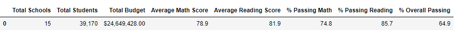
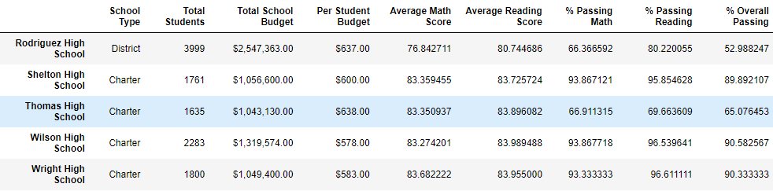
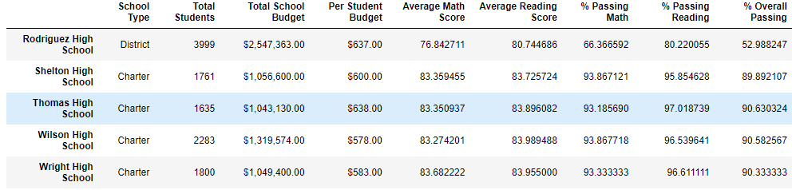
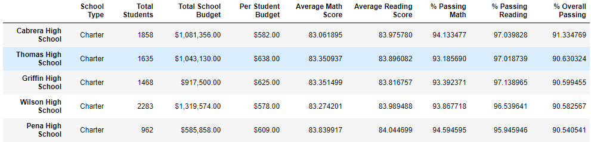
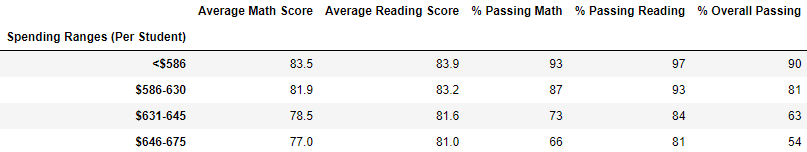
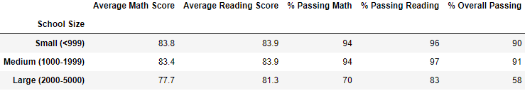
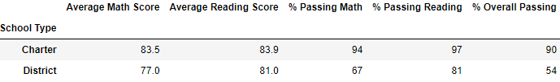

# School District Analysis

## Overview of School District Analysis

The broad goal of this project is to create a high level analysis of the school districts key performance. Specifically, all of the students math and reading standardized test data will be aggregated for analysis, reporting, and presentation to provide insights about performance trends and patterns. This analysis will assist the school board on making decisions regarding the school budgets and priorities. To accomplish this, Python (Pandas Library) and Anaconda (Jupyter Notebook) were used due to the tools that both offer when it comes to complex data analysis. An initial analysis was completed, but then it was discovered that 9th grade students from one of schools (Thomas High School) had flawed score data. Due to this, a second analysis was completed where those scores were removed from the data set. 

## Resources

- Data Sources: *schools_complete.csv*, *students_complete.csv*
- Software: Python 3.7 (Pandas Library), Anaconda (Jupyter Notebook package), Visual Studio Code 1.38.1

## Results

Please see below District Summary, which is after the re-analysis (removal of Thomas High School 9th grade scores).

The updated district summary is slightly different from the original (which includes Thomas High School 9th grade scores). Here are the results: the average math score decreased by .1, the average reading score remained the same, the % passing math decreased by .2, the % passing reading decreased by .1, and the % overall passing decreased by .3.  

- How is the school summary affected?

The above visualization is a snapshot of Thomas High Schools metrics once their 9th grade scores were removed. The scores decreased considerably from the original scores. This was because the calculations were not yet updated to adjust the student count to exclude all 9th graders. Please see the below visualization which depicts the updated scores after the student count was updated.

- Please see the below listed changes which occurred (relative to the original scores) after the re-analysis was completed (THS 9th graders grades' were replaced with NaN and they were removed from the student count).
  - Average math score decreased by .06
  - Average reading score increased by .05
  - % Passing math decreased by .09
  - % Passing reading decreased by .19
  - % Overall passing decreased by .31  
  - The Total School Budget & Per Student Budget were not effected.

### Top 5 Performing Schools

As you can see, once the Thomas High School 9th grade scores were replaced by NaN and the student count was updated to exclude THS 9th graders, THS retained their high scores (with slight changes as noted above) and remain in the top 5 of the school district. The bottom 5 schools in the district remain unchanged. An image showing them can be located in the resources folder, if needed.

### Scores by School Spending

There are no changes in the data for this Dataframe after the re-analysis. Interestingly, overall, the schools with the highest overall passing percentage had the lowest amount of spending per student. Conversely, the schools with the lowest overall passing percentage had the highest amount of spending per student. Increased funding does not appear to result in higher scores.

### Scores by School Size

There are also no changes in the data for this Dataframe. Small and Medium sized schools seem to have fared very well in their overall passing percentages (90% and 91% respectively). Large schools in this district seem to have really struggled with just a 58% overall passing percentage.

### Scores by School Type

The elimination of the Thomas High School 9th grade students also had no effect on this dataframe. Charter school students seem to perform very well (90% overall passing percentage) compared to District schools (54% overall passing percentage).

## Summary

The re-analysis of the school district data to exclude Thomas High School (THS) 9th grade students resulted in a number of changes to the data. At the same time, there were no changes where some may have been expected (ie Scores by School Size, Scores by School Type, Scores by School Spending). Replacing the THS 9th grade scores with NaN caused a steep drop in the scores, however, once the THS 9th grade students were removed from the student count, THS's scores increased. Between the inital analysis and 2nd analysis, THS's overall passing percentage decreased by .31. In both cases, THS is ranked #2 in performance in the district. Some of the other changes which occured between the analyses were in the School District Summary where a few of the metrics decreased by anywhere from .1 to .3. The removal an entire school's 9th grade scores from this data set was not optimal, but it was necessary to maintain the integrity of the data. To see the full script of the initial analysis please see the *PyCitySchools.ipynb* file. The re-analysis script can be accessed in the *PyCitySchools_Challenge.ipynb* file.
